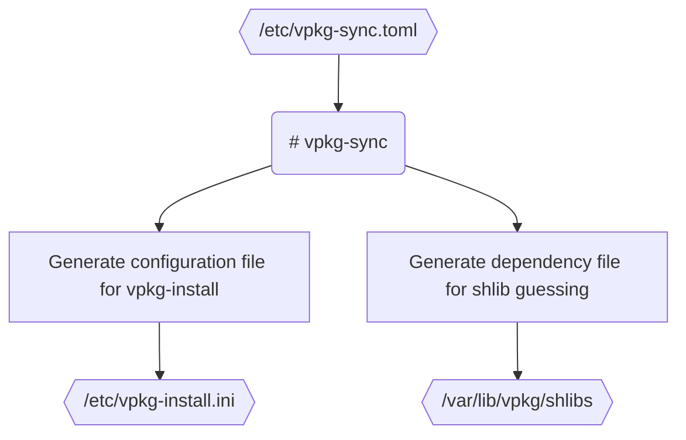

**Use at your own risk!**

The software is currently in the early stages of development. The code is not
polished and may contain bugs; refactoring is needed. There are no releases,
since the software is not yet production-ready.

I use `vpkg` on production systems and try my best to ensure it won't cause
issues, but nothing is guaranteed. You have been warned.

# vpkg

`vpkg` is a meta package manager, wrapped around `xdeb` and `xbps`. It provides
3 CLI utilities: `vpkg-sync`, `vpkg-query`, and `vpkg-install`. The latter two
are akin to their `xbps` counterparts.

## Dependencies

```
libxbps-devel
libcurl-devel
make
gcc
xdeb from master
```

```
python3-requests
python3-pydantic
```

## vpkg-sync

`vpkg-sync` is a Python utility required to tell `vpkg-install` which packages
are available. The user provides a configuration file `/etc/vpkg-sync.toml`,
where they specify package sources. Currently available package sources are:

- Debian repositories
- GitHub repositories
- URLs

Running

```
# vpkg-sync
```

will update the package database `/etc/vpkg-install.ini` and the shlibs file
`/var/lib/vpkg/shlibs`. All library packages will be renamed to `lib*-debian`
by default to prevent conflicts with system libraries.



## vpkg-install

After successful package synchronization using `vpkg-sync`, the user may
install custom packages using:

```
# vpkg-install <name>
```

or force install (reinstall) a package using

```
# vpkg-install -f <name>
```

or update a package using

```
# vpkg-install -u <name>
```

or update all packages using

```
# vpkg-install -u
```

## vpkg-query

All packages will be tagged `xdeb` by default and registered in the `xbps`
database. The utility `vpkg-query` is provided for easier management.

To list installed packages, run:

```
$ vpkg-query -l
```

To list available packages, run:

```
$ vpkg-query -Rl
```

To search available packages, run:

```
$ vpkg-query -Rl <substring>
```

To search installed packages, run:

```
$ vpkg-query -l <substring>
```

## Notice
- Libraries require the environment override `LD_LIBRARY_PATH="${LD_LIBRARY_PATH}:/usr/lib/x86_64-linux-gnu"`
- Only the newest package versions may be installed.
